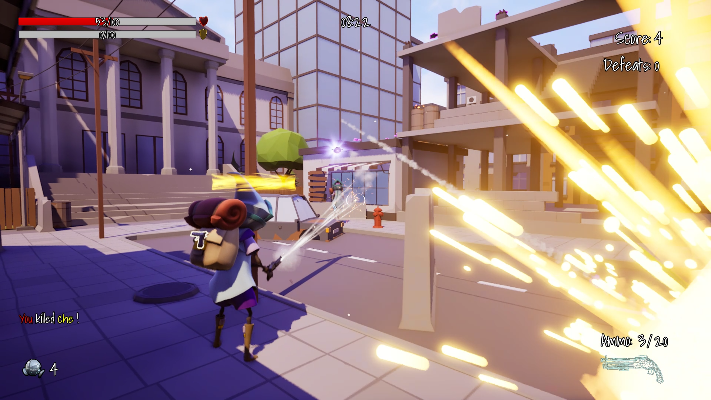

# StrikeNet Game

A dynamic multiplayer third-person shooter developed using C++, featuring different game modes, numerous weapons, ammo, and buffs.

## Game building

To successfully build and run this game locally, the following soft will be required:

- Unreal Engine 5.4 or uppper
- Game assets and content
- Multiplayer Session plugin
- Steam account and Steam enabled

